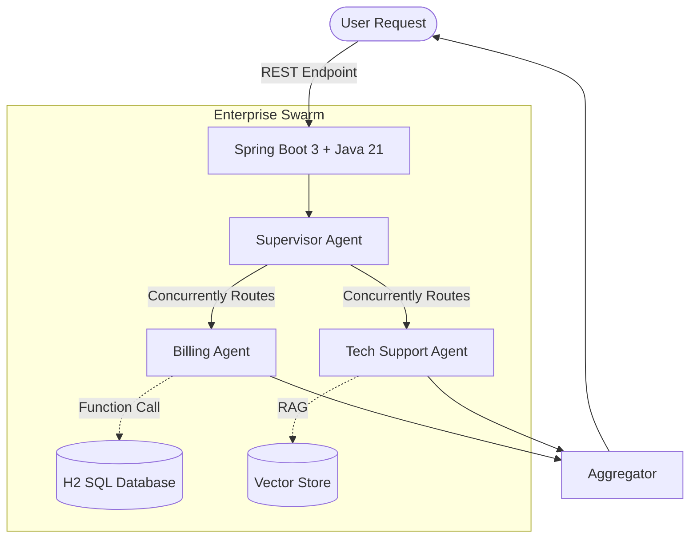

# 🚀 Enterprise Multi-Agent Orchestrator (Spring AI)


## Overview
A production-grade **Chief AI Officer** microservice designed to handle complex, multi-intent customer queries by orchestrating specialized AI Agents. 

This system bridges legacy JVM enterprise architectures with modern Generative AI by utilizing **Java 21 Virtual Threads** for massive concurrency and **Spring AI** for robust Agent/LLM abstractions.

## 📚 Documentation
For a deep dive into the architecture and components, please review the following:
- [Architecture Design](ARCHITECTURE.md)
- [Component Specifications](COMPONENTS.md)
- [Communication & IPC Strategy](COMMUNICATION.md)
- [UI/UX Dashboard Blueprint](UI_UX_DESIGN.md)
- [Project Roadmap](ROADMAP.md)

## 🧠 Architecture: The "Enterprise Swarm"
When a user submits a query, the system does not rely on a single, hallucination-prone monolithic LLM. Instead, it utilizes an Orchestrator pattern:

1. **Supervisor Agent (`SupervisorAgent.java`)**: The master orchestrator. It intercepts natural language requests, breaks them down, and distributes sub-tasks concurrently to specialized worker agents using `CompletableFuture` running on Java 21 Virtual Threads.
2. **Billing Agent (SQL Tool Calling)**: A specialized worker agent with exclusive access to the `BillingTools` class. It uses OpenAI Function Calling to securely execute deterministic logic (e.g., querying an H2 Database) to retrieve highly accurate financial records.
3. **Support Agent (RAG)**: A specialized worker agent dedicated to parsing IT Manuals and documentation to provide deterministic tech support.



## 🛠️ Key Technologies
- **Spring AI:** Abstracted chat clients and prompt engineering.
- **Function Calling:** Defined via standard Java `@Bean` and `@Description` annotations, seamlessly translated into LLM tools.
- **JPA & H2 In-Memory DB:** Secure sandbox for the Billing Agent.
- **Java 21 Project Loom:** Non-blocking Virtual Threads to ensure the Supervisor can handle hundreds of concurrent agent conversations without OS thread starvation.

## 🚀 Quick Start
1. Add your OpenAI API key to `src/main/resources/application.yml` (or export it as `OPENAI_API_KEY`).
2. Build and run the project:
   ```bash
   ./mvnw clean spring-boot:run
   ```
3. Test the Multi-Agent Orchestrator via REST:
   ```bash
   curl -X POST http://localhost:8080/api/chat \
   -H "Content-Type: application/json" \
   -d '{"customerId":"CUST-1001", "message":"Why is my bill so high, and how do I reset my EC2 password?"}'
   ```
