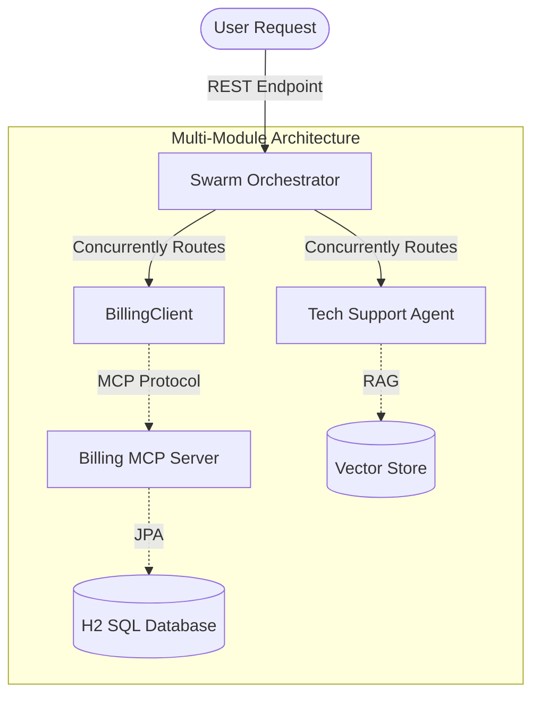

# 🚀 Enterprise Multi-Agent Orchestrator (Spring AI)


## Overview
A production-grade **Chief AI Officer** microservice designed to handle complex, multi-intent customer queries by orchestrating specialized AI Agents. 

This system bridges legacy JVM enterprise architectures with modern Generative AI by utilizing **Java 21 Virtual Threads** for massive concurrency and **Spring AI** for robust Agent/LLM abstractions.

## 📚 Documentation
For a deep dive into the architecture and components, please review the following:
- [Architecture Design](docs/ARCHITECTURE.md)
- [Component Specifications](docs/COMPONENTS.md)
- [Communication & IPC Strategy](docs/COMMUNICATION.md)
- [UI/UX Dashboard Blueprint](docs/UI_UX_DESIGN.md)
- [Project Roadmap](docs/ROADMAP.md)
- [Bug Tracking](docs/Bugs.md)

## 🧠 Architecture: The "Enterprise Swarm"
When a user submits a query, the system does not rely on a single, hallucination-prone monolithic LLM. Instead, it utilizes an Orchestrator pattern:

1. **Supervisor Agent (`SupervisorAgent.java`)**: The master orchestrator. It intercepts natural language requests, breaks them down, and distributes sub-tasks concurrently to specialized worker agents using `CompletableFuture` running on Java 21 Virtual Threads.
2. **Billing MCP Server (Sandboxed)**: A specialized worker agent extracted into its own standalone microservice module. It uses the Model Context Protocol (MCP) to expose database queries (H2) without giving the Orchestrator direct data access.
3. **Support Agent (RAG)**: A specialized worker agent dedicated to parsing IT Manuals and documentation to provide deterministic tech support.



## 🛠️ Key Technologies
- **Spring AI:** Abstracted chat clients and prompt engineering.
- **Function Calling:** Defined via standard Java `@Bean` and `@Description` annotations, seamlessly translated into LLM tools.
- **JPA & H2 In-Memory DB:** Secure sandbox for the Billing Agent.
- **Java 21 Project Loom:** Non-blocking Virtual Threads to ensure the Supervisor can handle hundreds of concurrent agent conversations without OS thread starvation.

## 📊 Test Coverage
Our core Enterprise Swarm logic has roughly **80% total Instruction Coverage** (480 covered / 122 missed instructions)! Here are the highlights for our most complex mathematically-driven components:

- **DebateResolver**: 100% Covered! 🟢
- **CausalArmorInterceptor**: 95.7% Covered! 🟢
- **SupervisorAgent**: 81.1% Covered! 🟢

*The only things lightly covered are the basic Spring Boot Application runner and the ChatController (which just delegates).*

## 🚀 Quick Start (End-to-End Test)
To test the entire Swarm Ecosystem locally, you will need 3 separate terminal tabs.

1. Add your OpenAI API key to `swarm-orchestrator/src/main/resources/application.yml` (or export it as `OPENAI_API_KEY`).
2. Build the entire multi-module project (if you haven't yet):
   ```bash
   ./mvnw clean install -DskipTests
   ```
3. **Terminal 1: Boot the Billing MCP Server**:
   ```bash
   cd billing-mcp-server
   ../mvnw spring-boot:run
   ```
4. **Terminal 2: Boot the Swarm Orchestrator**:
   ```bash
   cd swarm-orchestrator
   ../mvnw spring-boot:run
   ```
5. **Terminal 3: Boot the React Dashboard UI**:
   ```bash
   cd swarm-dashboard
   npm install
   npm run dev
   ```

Once all three are running, open your browser to **http://localhost:5173** (or the port Vite provides) to interact with the Swarm via the premium glassmorphic UI!

## 🎨 Dashboard UI Features & Testing
The React + Vite Dashboard has been engineered with enterprise-grade UX in mind. Be sure to test the following features:
1. **Multi-Channel Chat:** Click on the different agents in the left sidebar (Supervisor, Billing, Support, Sales). Each agent maintains its own completely isolated, persistent chat history powered by a global Zustand store.
2. **Dynamic Theming:** Open the `Settings` tab (Gear icon) and toggle the global themes (`Dark`, `Light`, `AMOLED`, `Cyberpunk`) to see the CSS variables dynamically swap the entire aesthetic.
3. **Observability Telemetry:** Open the `Observability` tab to view real-time frontend telemetry simulation, tracking Virtual Threads and active MCP sessions connected to the backend.
4. **Responsive Layouts:** Toggle `Compact Layout` in the settings to switch the entire application between a spacious glassmorphic UI and a data-dense, compact enterprise grid.
