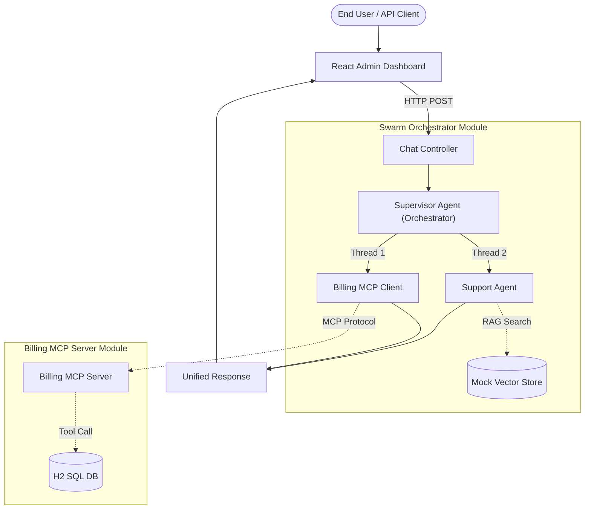

# Enterprise Agent Swarm: Architectural Design Document

## 1. Executive Summary
The **Enterprise Agent Swarm** is a robust, concurrent, multi-agent microservice architecture built on Java 21 and Spring Boot 3. It orchestrates complex Generative AI workflows inside a highly secure and strictly typed JVM environment. By leveraging the Orchestrator-Worker pattern, it routes user inquiries to specialized agents, restricting database access and AI hallucinations.

## 2. System Architecture

## 3. Core Architectural Decisions

### 3.1. Java 21 Virtual Threads (Project Loom)
**Problem:** Traditional AI microservices block OS threads waiting for LLM API responses (which take 2-10 seconds). This leads to thread exhaustion.
**Solution:** The Supervisor Agent uses `CompletableFuture.supplyAsync()`, which in Java 21 maps to lightweight Virtual Threads. This allows the application to handle 10,000+ concurrent LLM requests on a standard JVM without blocking OS threads.

### 3.2. Model Context Protocol (MCP) Sandboxing
**Problem:** LLMs cannot be trusted to perform math or securely query billing ledgers. Additionally, putting database credentials in the same application as conversational AI logic increases the attack surface.
**Solution:** We extracted the billing ledger logic into a completely separate microservice (`billing-mcp-server`). It communicates with the AI Orchestrator via the **Model Context Protocol (MCP)**. The LLM extracts parameters, the Orchestrator sends an MCP function execution request to the Billing Server, and the Billing Server securely queries its H2 DB and returns the deterministic result.

### 3.3. Isolation of Concerns
- **React Frontend Dashboard:** A separate Node.js/Vite environment responsible only for telemetry visualization (HTN DAG) and user I/O.
- **Billing MCP Server:** A strict, sandboxed Spring Boot module without any conversational logic, solely bonded to the `BillingTools`.
- **Support Agent:** Cannot access financial data; strictly bonded to the technical documentation via RAG.
- **Supervisor Agent:** Only responsible for understanding intent and parallel dispatching.

## 4. Scalability & Deployment
- **Stateless Design:** The microservice is completely stateless. Session context can be managed via external Redis clusters, allowing horizontal scaling across Kubernetes pods.
- **Observability:** Easily integrates with Micrometer and Zipkin for distributed tracing, which is essential to track which sub-agent is causing high latency.
